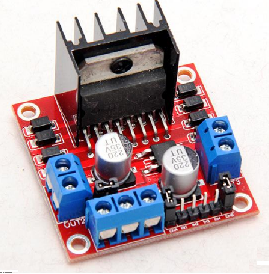

# L298N
ST L298N Dual H-Bridge Motor Controller Module Driver for TiJOS.

| 条目         | 说明                        |
| ---------- | ------------------------- |
| 驱动名称       | L298N 电机驱动器               |
| 适用         | 该驱动适用于 L298N 电机驱动器        |
| 通讯方式       | PWM                       |
| Java Class | TiL298N.java              |
| 图片         |  |
